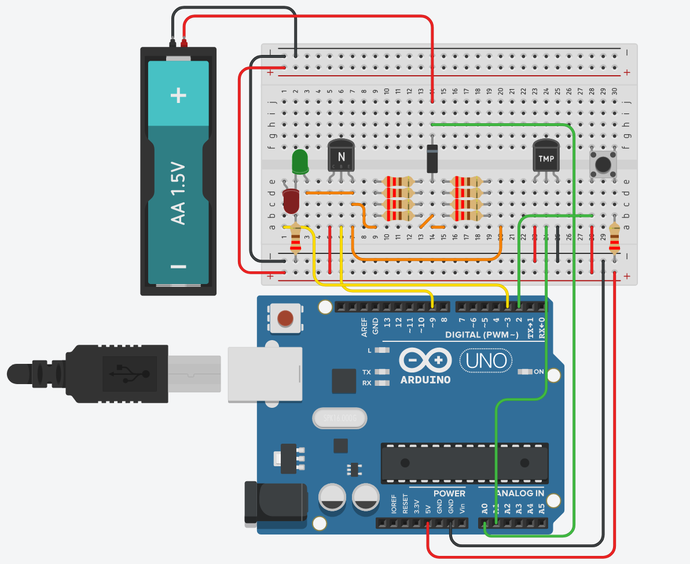

# Arduino alkaline-battery charger

An arduino project for charging non-rechargable battery

## Disclaimer, or, use at your own risk

Charging non-rechargable battery is dangereous and must be done knowing the risks

Only charge battery that meet this requirements:
 - Must an alkaline
 - Residual voltage > 1.20V
 - No damage or corrosion

## Diagram



## Materials

This project require only components that are available on the Arduino Starter Kit.
 - 1x  Arduino Uno rev3
 - 10x 220 Ohm resistor
 - 1x  Diode
 - 1x  Green LED
 - 1x  Red LED
 - 1x  TMP36 Temperature sensor
 - 1x  BC547 Transistor
 - 1x  Push button

## How to use it

Reproduce the circuit, paste the programm in the arduino IDE, download the [Timer1][1] library, change the value of the constant if needed and you are good to go.

Make sure to keep the battery well connected during the recharge process if you do not have a good mounting for the battery as it can leed to errors.

## How it works

### Current send to the battery

Non-rechargeable alkaline battery are rechargeable if the current is low enought and if they do not heat.

For that I am going to send a square periodic current throught the battery. The breaks allow the battery to cool down.

```
   <- 120 ms ->
5V ------------|  |------------|
               |  |            |
0V             |--|            |--
               <--> 5ms
```

### Why use a transistor and not the output pin directly ?

Each digital pin of the arduino are capable of a maximum output of 40mA. That is not enought in our case.

TODO: Complete the explaination

## Library

Arduino `analogWrite()` function don't allow to set the frequencies of the PWN. So to create a PWM with a frequency of 8Hz I use the [Timer1][1] library.

## References
TODO

[1]: https://github.com/PaulStoffregen/TimerOne
